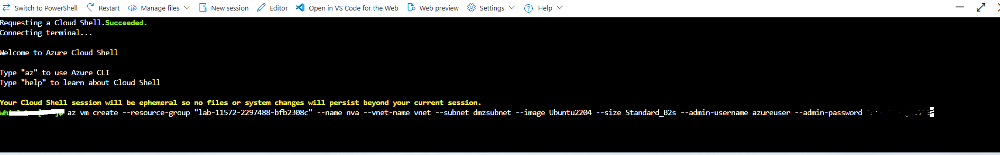
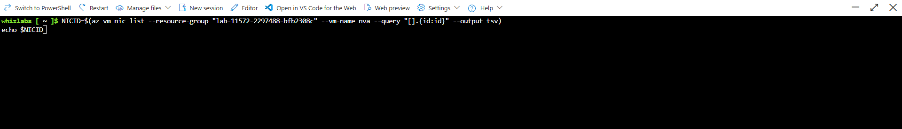
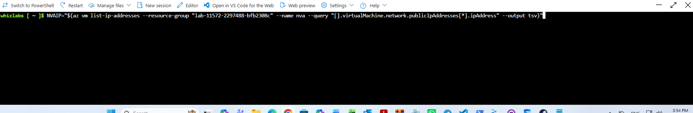
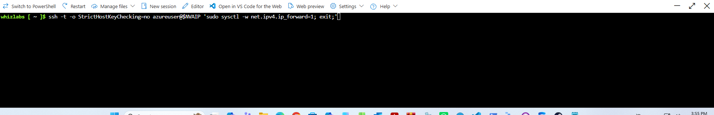
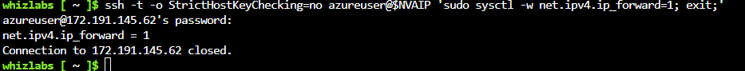
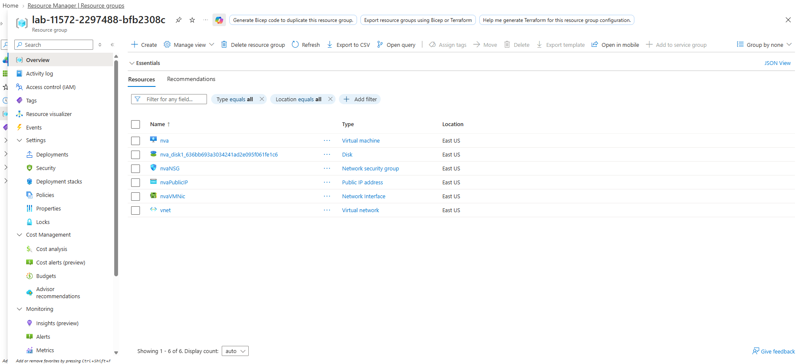

# Deploy an NVA and Set Up Virtual Machines

This project demonstrates deploying an Ubuntu 22.04 Linux Virtual Machine as a Network Virtual Appliance (NVA) inside a DMZ subnet using Azure CLI, and configuring kernel-level IP forwarding to route traffic between virtual network subnets.

---

## Lab Architecture & Parameters
* **Resource Group:** `lab-11572-2297488-bfb2308c`
* **NVA Name:** `nva`
* **Operating System:** Ubuntu Server 22.04 LTS Gen 2
* **VM Size:** Standard_B2s (2 vCPUs, 4 GiB memory)
* **Virtual Network / Subnet:** `vnet` (10.0.0.0/16) / `dmzsubnet` (10.0.0.0/24)
* **NVA Private IP:** 10.0.0.4
* **NVA Public IP:** 172.191.145.62
* **Azure NIC IP Forwarding:** Enabled (`enableIPForwarding: true`)
* **Kernel Forwarding:** `net.ipv4.ip_forward = 1`

---

## 1. Deploy the NVA Virtual Machine
The NVA instance is provisioned into the `dmzsubnet` of `vnet` using the Azure CLI:

az vm create \
  --resource-group "lab-11572-2297488-bfb2308c" \
  --name nva \
  --vnet-name vnet \
  --subnet dmzsubnet \
  --image Ubuntu2204 \
  --size Standard_B2s \
  --admin-username azureuser \
  --admin-password <password>

---

## 2. Identify Network Interface & Public IP
Retrieved the Network Interface ID to configure IP forwarding, as well as the public IP assigned to the appliance:

NICID=$(az vm nic list --resource-group "lab-11572-2297488-bfb2308c" --vm-name nva --query "[].{id:id}" --output tsv)
echo $NICID

NVAIP="$(az vm list-ip-addresses --resource-group "lab-11572-2297488-bfb2308c" --name nva --query "[].virtualMachine.network.publicIpAddresses[*].ipAddress" --output tsv)"

---

## 3. Enable In-Guest Kernel IP Forwarding
Connected to the NVA remotely using SSH through Azure Cloud Shell to enable packet forwarding directly in the Linux kernel via `sysctl`:

ssh -t -o StrictHostKeyChecking=no azureuser@$NVAIP 'sudo sysctl -w net.ipv4.ip_forward=1; exit;'

Confirmed that `net.ipv4.ip_forward = 1` was successfully applied to the network stack:

---

## 4. Verify Provisioned Infrastructure
Verified in the Azure Portal that all supporting infrastructure components were provisioned in `lab-11572-2297488-bfb2308c`:
* **nva:** Ubuntu virtual machine appliance
* **nva_disk1:** 30 GB Premium SSD OS disk
* **nvaNSG:** Security group allowing inbound SSH (TCP 22)
* **nvaPublicIP:** Standard regional static public IP (`172.191.145.62`)
* **nvaVMNic:** Network interface with IP forwarding enabled
* **vnet:** Virtual network containing `dmzsubnet`

---

## 5. Deployment Artifacts
* The exported ARM deployment template capturing the NVA VM, `nvaVMNic` with IP forwarding configuration, NSG, and virtual network is stored in `template_4.json`.
